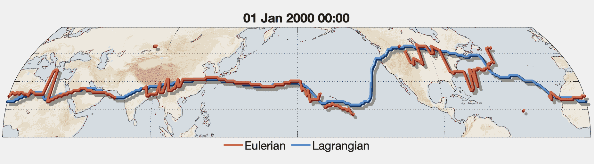




  


  

**Methods paper accepted for publication in Commun. Earth Env.** 
Access the [pre-print](https://www.doi.org/10.22541/essoar.175760518.83376258/v1). 
Access the [dataset](https://doi.org/10.5281/zenodo.16178219). 
Sign up for the [JetLag mailing list](https://web.lists.fas.harvard.edu/mailman/lists/jetlag.lists.fas.harvard.edu/) to be notified. 

---

**What is JetLag?** 

JetLag is a jet stream diagnostic algorithm I developed at Harvard/MIT in collaboration with [Dr. Jezabel Curbelo](https://web.mat.upc.edu/jezabel.curbelo/) (BarcelonaTech) with primary funding from [Centre de Recerca Matemàtica](https://www.crm.cat/) and Dr. Marianna Linz. 
JetLag relies on Lagrangian descriptors of the general circulation, hence the name.

---

**Why JetLag?** 

Many jet tracking algorithms already exist, but significant limitations remain:

* Jets are usually defined in the Eulerian perspective (using instantaneous or time-averaged meteorological fields) and therefore do not explicitly account for the meandering of jets over time;

  _JetLag defines jets as Lagrangian features to account for their spatial <em>and</em> temporal coherence_

* Jet diagnostics rely on a variety of ad hoc empirical and climatological parameters (e.g., fixed latitude bands, wind-speed cutoffs). These choices tie the jet diagnostic to a specific climate state;

  _JetLag's 2 parameters are rooted in wave dynamics, and JetLag exhibits extremely low sensitivity to them_

* Most algorithms are tailored to track either the subtropical jet or the polar front jet, but not both;

  _JetLag identifies both jet types with the same method_

---

**How does JetLag work?** 

JetLag is based on a Lagrangian descriptor of the atmospheric circulation known as the $\mathcal{M}$ function. At any point (x,y,z,t), the $\mathcal{M}$ function measures the length of an air parcel's trajectory initiated at (x,y,z,t) and integrated forward and backward in time over an interval {t-$\tau$ ; t+$\tau$}. The key parameter in JetLag is the integration time 
$\tau$, which can be determined objectively based on the scales of interest, and to which the output exhibits virtually no sensitivity.

The $\mathcal{M}$ function highlights organizing features of the flow that remain coherent over the integration interval. JetLag exploits these structures to identify jets that are coherent in both space and time, effectively separating jets from transient wave activity.

---

**What does JetLag provide?** 

A [dataset](https://www.doi.org/10.5281/zenodo.16178219) based on ECMWF's ERA5 reanalysis 1941-2025 is available for the subtropical jets and the polar front jets.

Other products will be released over time, including products for CMIP6/7 and LENS2 simulations. 

Contact us if you are interested in a product that is not available. 

---

**How do I get in touch?** 

Feel free to email me directly. We also have a mailing list: email with 'subscribe' in the subject to jetlag-join@lists.fas.harvard.edu
