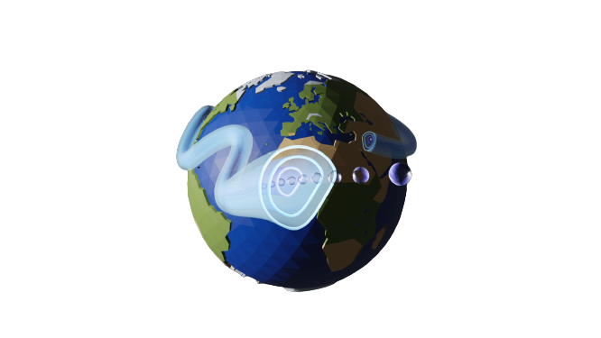




  


**The JetLag dataset will be released shortly -- paper under review** 
Access the [pre-print](../files/JetLag_manuscript_2025_LR.pdf). 
Sign up for the [JetLag mailing list](https://web.lists.fas.harvard.edu/mailman/lists/jetlag.lists.fas.harvard.edu/) to be notified. 

---

**What is JetLag?** 

JetLag is a jet tracking algorithm conceptualized in collaboration with [Dr. Jezabel Curbelo](https://web.mat.upc.edu/jezabel.curbelo/) (Universitat Politècnica de Catalunya/BarcelonaTech) with the financial support of [Centre de Recerca Matemàtica](https://www.crm.cat/) (Universitat Autònoma de Barcelona). [Dr. Marinna Linz](https://eps.harvard.edu/people/marianna-linz/) (Harvard University) also provided support for this project. 
JetLag relies on Lagrangian descriptors of the general circulation, hence the name.

---

**Why JetLag?** 

Many jet tracking algorithms already exist, but significant limitations remain:

* Most algorithms define the jets in the Eulerian framework (instantaneous or time-averaged meteorological fields) and therefore overlook the coherence and behavior of jets over time;

  _JetLag defines jets as Lagrangian coherent structures to account for their spatial <em>and</em> temporal coherence_

* Most algorithms rely on a variety of empirical, climatological parameters to define jet features (e.g. latitude and wind magnitude thresholds). Such algorithms are tailored to a particular state of the climate and may not be suited to other climate states;

  _JetLag's 2 parameters are rooted in wave dynamics and independent of the state of the climate_

* Most algorithms are tailored to track either the subtropical jet or the polar front jet, but not both;

  _JetLag identifies both jet types with the same method_

---

**How does JetLag work?** 

The algorithm uses a Lagrangian descriptor of the general circulation, the 'M function', which is defined at any location (x,y,z,t) as the length of the Lagrangian parcel trajectory initiated at (x,y,z,t) and integrated over a chosen time interval {t-$\tau$ ; t+$\tau$}. The main parameter used in JetLag is the length of that time interval, $\tau$, which can be determined objectively based on the scales of interest, and to which the output exhibits virtually no sensitivity.

The M function highlights Lagrangian coherent structures--organizing features of the circulation that correspond to maxima in atmospheric displacement and that are invariant over the chosen integration interval. JetLag relies on these features to locate jets that are coherent in space and in time, effectively separating jets from underlying waves.

---

**What does JetLag provide?** 

A dataset based on [ERA5](https://www.ecmwf.int/en/forecasts/dataset/ecmwf-reanalysis-v5) is ready for 1941-2020 for the subtropical jets and the polar front jets. We expect its public release in the coming months along with a paper detailing the methods.

Other products will be released over time, including products for CMIP6/7 and [LENS](https://www.cesm.ucar.edu/community-projects/lens) simulations. 

Contact us if you are interested in a product that is not available. 

---

**Can I get involved?** 

We'd love to hear your thoughts. You can reach out to us via the mailing list (once you've subscribed, email: jetlag-owner \[replace with at symbol\] lists (dot) fas (dot) harvard (dot) edu) or directly via my professional email (lrivoire \[replace with at symbol\] mit (dot) edu).
