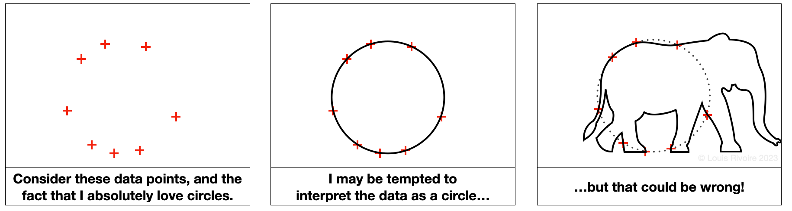
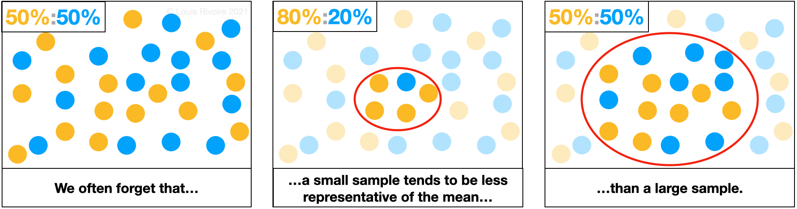




  


**How to spot online lies before you hit "share"**

Disinformation is designed to mislead, confuse, and erode trust, and it has become easier than ever to spread. Whether it is spread by state actors, news sources, social media, celebrities, or word of mouth, disinformation affects all of us. Luckily, we can spot it if we know what to look for:

-   **Exaggeration**, alarmism based on anecdotes, cherry picking, one-sided arguments, parallels with extreme ideologies, miracle solutions;
-   **Speculation** ("isn't it weird that...?"), absence of verifiable sources, hearsay, insubstantial statements, reasoning based on hard-to-verify factoids, slippery slope arguments (a small event triggers a cascade of inevitable negative outcomes);
-   **Overuse of recognizable key words**, even off topic, associations with controversial ideas that have little in common;
-   **Call to emotions** more often negative than positive, fixation on alleged scandals or unusual events;
-   **Call to distrust** governments and institutions, science and technology, undefined entities ("they") that are said to be lying to/acting against the entire population, call to consider 'mainstream ideas' as inherently wrong.

These tactics work because they exploit cognitive biases: shortcuts in how we interpret information, especially under emotional or time pressure. A few are illustrated below (illustrations original, all rights reserved):

**CONFIRMATION BIAS** (the M.O.A.B.)

Confirmation bias—the tendency to favor information that supports existing beliefs over information that challenges them—is widespread and likely reflects a general human preference for confirmation over refutation.

A harmless example is cloud watching: if someone points out a shape (say, a whale), we can often “see” it too, even though we might have interpreted the cloud differently without that prompt.

In more consequential settings (jury decisions, healthcare, hiring, and scientific research), confirmation bias can reinforce false ideas and deepen polarization, especially around emotionally charged or identity-linked issues.

**MERE-EXPOSURE EFFECT** (preference for early information, the basis for advertisement):

**RECENCY BIAS**:

**GAMBLER'S FALLACY**:

**INSENSITIVITY TO SAMPLE SIZE**:

**ANCHORING BIAS**:

**SURVIVORSHIP BIAS**:

More on cognitive biases:

<b>Image Credits - Wikipedia CC BY-SA 4.0</b>
