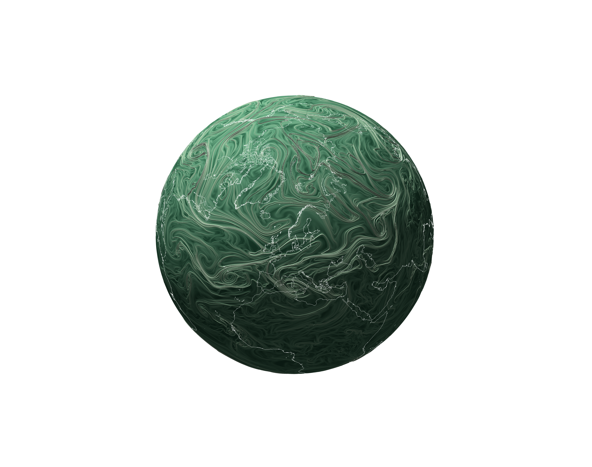

  
  

    The Lagrangian framework identifies jets by their material function rather than
    instantaneous wind maxima. This circular image layout keeps the globe visible and
    the text aligned beside it on wider screens, stacking gracefully on smaller ones.
  

