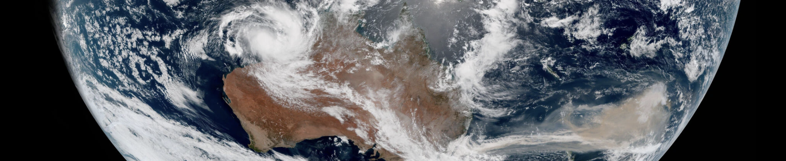
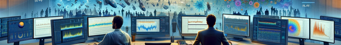
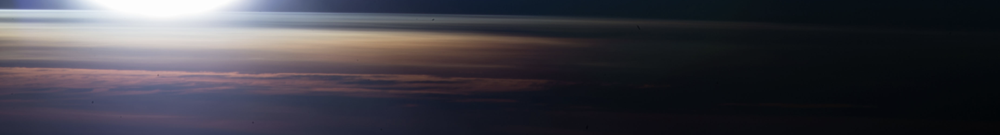
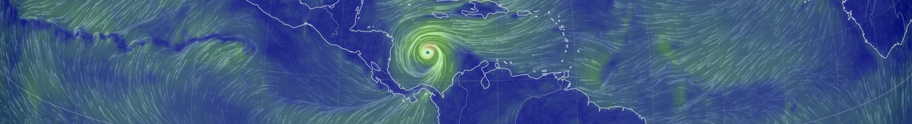
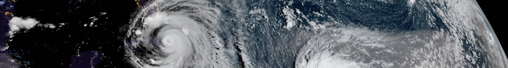




  


## Atmospheric transport

Gases and particulates are transported far from their origins by the atmosphere and its strongest currents (the jet streams), affecting atmospheric chemistry, air quality, and climate. However, transport processes are subject to large errors in climate models, in part because numerical models are overly diffusive. In parallel, changes in the behavior of the jets in response to human activity remain uncertain. This has important implications for the validity of climate projections, especially since highly nonlinear chemical and dynamical processes can lead to very large errors. My research in this area is primarily driven by the following questions:

* **What is a jet, anyway?** [Dr. Jezabel Curbelo](https://web.mat.upc.edu/jezabel.curbelo/) and I set to develop a robust and objective framework to understand how jets may behave in the future. We started by revisiting the very definition of the jets, showing that a Lagrangian view has many advantages over the traditional Eulerian view (see [JetLag](https://lrivoire.github.io/JetLag)). Our work is currently under review with Nat. Commun. Earth & Env.
* **How badly do climate models overestimate the dispersion of airborne material?** I am working with [Dr. Arlene Fiore](https://www.teampaccc.mit.edu/) and [Dr. Sebastian Eastham](https://www.imperial.ac.uk/people/s.eastham) to develop a new definition of coherent 'air mass' and quantify the rate at which wildfire smoke and urban emissions are dispersed by the real atmosphere. We hope to quantify model errors, so that they can eventually be corrected.<!-- My research in this area focuses on the transport of ozone between two atmospheric reservoirs with drastically different properties: the troposphere (humid and poor in ozone) and the stratosphere (very dry and rich in ozone). Sometimes, air parcels that originate in the stratosphere travel downward through the tropopause and into the troposphere, sometimes all the way down to the surface, bringing large amounts of ozone to areas that normally exhibit low concentrations of it. This process is called "tropopause folding" or "stratospheric intrusions" and can trigger air quality issues that affect human and ecosystem health, and agricultural yields. To date, we are unsure how the downward transport of ozone associated with stratospheric intrusions may change in the future. Changes in the transport may be dominated by a) changes in the composition of the lower stratosphere, or b) changes in the frequency of stratospheric intrusions. The main challenge in addressing this issue comes from limited satellite coverage and resolution. I am currently collaborating with Universitat Politècnica de Catalunya to develop JetLag, a new jet tracking algorithm that will be the first stepping stone toward taking a new look at this issue. JetLag uses Lagrangian descriptors of the general circulation to produce improved jet coordinate products that are useful in locating stratospheric intrusions. We're also using machine learning to make use of widely available total column ozone retrievals and establish an observational baseline for the ozone transport associated with stratospheric intrusions. Initial results were presented at the [2022 EGU General Assembly](https://meetingorganizer.copernicus.org/EGU22/EGU22-8959.html), and at the [SPARC General Assembly](https://lrivoire.github.io/talks/2022-10-24-talk). Sign up for the JetLag mailing list [here](https://lrivoire.github.io/JetLag).-->

---

## Emergence of climate trends

The planet is [warming](https://www.climate.gov/news-features/understanding-climate/climate-change-global-temperature), but some long-term changes remain difficult to confirm observationally (e.g., shifts in the jets, trends in midlatitude lower stratospheric ozone, changes in the Brewer-Dobson Circulation and in the Atlantic Meridional Overturning Circulation). After all, the climate system is noisy, making it difficult to distinguish trends from noise, and our historical records are limited in time and space, making it difficult to see the full picture. In order to determine whether a trend is 'real' or an artifact, I seek to answer the following questions:

* **Have we collected enough data?**
* **Are observed changes significantly larger than random fluctuations of the climate system?**

I developed a [new method](https://agupubs.onlinelibrary.wiley.com/doi/full/10.1029/2024GL109638) with collaborators at SCRIPPS and Harvard to answer these questions and properly assess the degree of confidence we should place in long-term trends calculated from historical records. The method has already been applied to long-term trends in the [stratospheric circulation](https://doi.org/10.1029/2023RG000832) and the [ozone layer](https://doi.org/10.5194/acp-25-2269-2025), and it also informed the budget and logistics for a [satellite mission proposal](https://ui.adsabs.harvard.edu/abs/2023AGUFM.A34G..08N/abstract) led by JPL.

---

## Atmospheric composition

Without the stratospheric ozone layer, life on Earth would likely be severely limited by ultraviolet (UV) radiation exposure. The [ozone hole](https://ozonewatch.gsfc.nasa.gov/facts/hole_SH.html) has understandably garnered tremendous scientific concern. Its recovery since the 2000s is the object of ongoing research and monitoring, in particular, the interaction between the ozone layer and the stratospheric circulation. Ozone also plays a role lower down, for instance in the upper tropical troposphere where it acts as a potent greenhouse gas. Multiple factors contribute to changes in ozone abundances there, making it challenging to attribute observed trends to specific processes. Some questions I am working to address include:

* **Are expected changes in the strength of the stratospheric circulation detectable using observations?** Some of my work appears in a [review paper](https://doi.org/10.1029/2023RG000832) and uses the time of emergence framework described above to answer this question. I have also contributed to the development of a new satellite mission at Caltech's Jet Propulsion Laboratory to monitor the circulation of the stratosphere and its connection with its composition.
* **What degree of confidence should we place in long-term ozone trends seen by satellites?** A [study](https://doi.org/10.5194/acp-25-2269-2025) I led with collaborators from JPL, Harvard, and Princeton showed that some satellites, contrary to expectations, provide a distorded view of long-term changes in stratospheric ozone. This may help to explain discrepancies in recent literature.
* **Can models help us understand ozone change and variability in the historical record?** Human activity has already been shown to have a major impact, and I am working to understand the role of another major influence: biomass burning. 
<!--Starting in the 1930s, emissions of synthetic compounds such as chlorofluorocarbons (CFCs) have depleted ozone concentrations in the stratosphere, which led to the appearance of the so-called *ozone hole*. The 1987 Montreal Protocol banned the production of CFCs, and their stratospheric concentrations have ever since been decreasing. Over time, this decrease is expected allow stratospheric ozone concentrations to return to their previous levels. However, whether ozone concentrations have already started to recover or not remains a somewhat open question; while the size of the ozone hole has generally decreased since ~2000, large recent variability prevents scienstists from reaching conclusions with a large degree of statistical confidence. At the center of this problem lies the difficult task of establishing a framework to disentangle possible trends in ozone from a multitude of long-term oscillations in the climate system and their complex interactions with changes in the circulation and in the chemical composition of the stratosphere. In addition to this challenge, one must account for the limitations of current observing systems when analyzing long-term trends. I am working with collaborators at Caltech's Jet Propulsion Laboratory and at Princeton's Geophysical Fluid Dynamics Laboratory to provide answers to the question of the statistical significance of the expected ozone recovery. [Initial results](https://ams.confex.com/ams/102ANNUAL/meetingapp.cgi/Paper/398300) were presented at the 21st Conference on Middle Atmosphere of the American Meteorological Society.-->

---

## Tropical cyclones

<!-- Floods, droughts, heatwaves, cold spells, and tropical cyclones have one thing in common: they are relatively rare. As a result, assessing how well our climate models capture these events or the conditions under which they arise is difficult. During my time as a Ph.D. student, I became increasingly interested in tropical cyclones and what may happen to them in the future; as the planet warms on average, regional changes also occur.-->
Tropical cyclones have historically been studied from the surface up, mostly because of the extensive damage they produce at the surface. However, tropical cyclones also affect the upper atmosphere around them, with climate impacts that are still uncertain. During my PhD, I asked:

* **What is cooling the tropopause above tropical cyclones?**
* **What effects, if any, does this cooling have on tropical cyclones and on the climate system at large?**

I started by providing a new [detailed view](https://lrivoire.github.io/publication/2016-09-24-evolution) of the fine-scale structure of cold anomalies found above tropical cyclones, and [ruled out](https://lrivoire.github.io/publication/2020-06-18-quantifying) cloud radiative effects as the main mechanism. The cooling appears to be of dynamical nature (a response to the release of latent heat by convective activity in the core of the cyclones), but the effects of the cooling on the cyclones themselves remains an open question.

<!-- In the context of climate change, the regions where tropical cyclones form, intensify, and eventually make landfall could change over time. A [project](https://ams.confex.com/ams/34HURR/meetingapp.cgi/Paper/386675) I started with collaborators from Purdue and NOAA looked at future scenarios to inform adaptation and mitigation planning. 
 on meso- to synoptic scales, change is expected in both the tropical cyclogenesis (where and when cyclones form) and in the so-called "steering flow" (where cyclones go). Climate simulations lend themselves well to analyzing changes in the steering flow--however, doing so has thus far involved combining complex vortex tracking algorithms, downscaling techniques, and compositing techniques. While these tools have been useful in making projections, their reliance on empirical, arbitrary, or even model-dependent parameters makes them subject to hidden sensitivities and limited reproducibility. In addition to these shortcomings, climate simulations are not designed to capture the processes at play in tropical cyclogenesis, making risk projections more uncertain. Thus, questions about future tropical cyclone risk remain undoubtedly open, calling for an approach focused on isolating the mechanisms that explain the projected changes. Answers to these questions will inform where and when tropical cyclone risk may reach new areas, a problem of particular importance to low-lying nations and to coastal populations. I am currently working with collaborators at Purdue and NOAA, using a combination of synthetic tropical cyclone trajectories, climate simulations, the historical record of tropical cyclone tracks, and a novel application of multivariate analysis. [Initial results](https://ams.confex.com/ams/34HURR/meetingapp.cgi/Paper/386675) were presented at the AMS 34th Conference on Hurricanes and Tropical Meteorology (May 2021). We are also using so-called geo-engineering scenarios from the [GeoMIP archive](http://climate.envsci.rutgers.edu/geomip/) as a way to quantify the uncertainties and risks associated with the unintended consequences of solar radiation management techniques. -->

 <!-- ## Tropical cyclone structure and dynamics

 <!-- impacts unfold at the surface, and in part because of the historical scarcity of upper-air observations above open waters.  With the advent of unmanned aircrafts and limb scanning spaceborne instruments, upper-air observations have become more readily available; for example, GPS radio occultation technology now allows the retrieval of the temperature structure in the upper troposphere and lower stratosphere (UTLS) globally, with ~100 m vertical resolution, ~0.1 K accuracy, and in all weather conditions. These data reveal the presence of a ubiquitous, synoptic-scale layer of [cold air near the tropopause above tropical cyclones](https://lrivoire.github.io/publication/2016-09-24-evolution) (and other convective systems), which I call tropopause layer cooling (TLC). The existence of this signal had been documented as early as the 1940s, but its detailed structure and evolution over the lifetime of tropical cyclones had remained unknown until recently. More importantly, the origins of TLC and its potential impacts on the development of the storm below still remain uncertain. Several mechanisms have been proposed to explain TLC, including diabatic cooling at the top of the cloud canopy, and adiabatic cooling due to ascent and divergence. We now know that [cloud radiative effects are unlikely to explain TLC](https://lrivoire.github.io/publication/2020-06-18-quantifying), and I am conducting ongoing research into the mechanisms that main explain ascent and divergence near the tropopause. As to the potential impacts of TLC on the storm below, they include increased potential intensity, turbulence in the outflow layer, heightened clouds, and possible effects on subsequent convection (after the storm has passed). A hierarchical approach with idealized simulations will be necessary to disentangle these effects. -->
